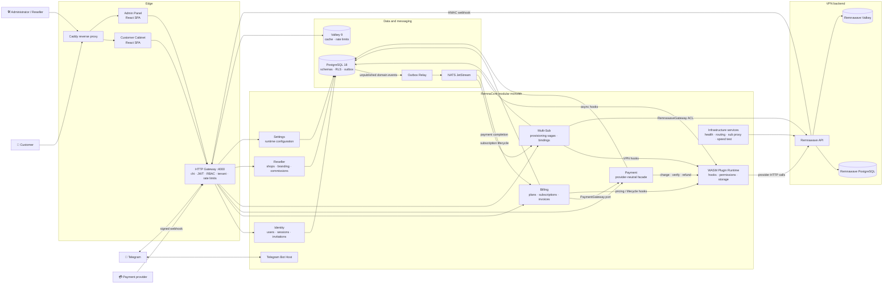
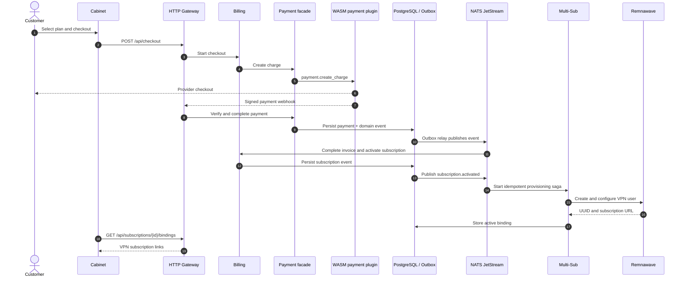

# 🌊 RemnaCore

> Modular, multi-tenant VPN subscription platform built with Go and powered by
> [Remnawave](https://github.com/remnawave/panel).

RemnaCore brings identity, billing, payments, VPN provisioning, reseller shops,
Telegram bots, and a WASM extension runtime into one deployable platform.

## ✨ Highlights

- 🧩 **DDD modular monolith** — six isolated domain contexts in one Go binary
- 🔌 **Hexagonal architecture** — domain code talks to infrastructure through ports and adapters
- ⚡ **Event-driven workflows** — transactional outbox → NATS JetStream → idempotent consumers
- 🛡️ **Tenant isolation** — PostgreSQL Row-Level Security and a least-privilege runtime role
- 🧱 **WASM plugins** — payments, notifications, pricing, VPN providers, and bot extensions
- 🔗 **Multi-subscription model** — one platform user can own multiple independent VPN bindings
- 🏪 **White-label shops** — branding, scoped RBAC, commissions, API keys, and shop bots
- 📱 **Two React applications** — customer cabinet and administration panel
- 📈 **Operations-ready foundation** — health checks, Prometheus metrics, tracing, backups, Helm, and Pulumi

## 🗺️ Architecture at a glance



### How a subscription is provisioned



## 🧠 Domain contexts and platform subsystems

RemnaCore has **six domain contexts**. Gateway, plugin runtime, infrastructure,
and Telegram are supporting platform subsystems rather than additional bounded
contexts.

| Area | Kind | Responsibility |
|---|---|---|
| **Identity** | Domain | Registration, ES256 JWT sessions, profiles, invitations, Telegram auth, RBAC |
| **Billing** | Core domain | Plans, checkout, subscriptions, invoices, trials, add-ons, family groups, proration |
| **Multi-Sub** | Core domain | Platform user → N VPN bindings, provisioning/deprovisioning sagas, reconciliation |
| **Payment** | Supporting domain | Provider-neutral payment records and WASM hook dispatch |
| **Reseller** | Supporting domain | Shops, tenants, white-label branding, commissions, API-key access |
| **Settings** | Supporting domain | Persisted settings and safe runtime configuration updates |
| **Gateway** | Platform | HTTP routing, authentication, permissions, tenant resolution, CORS, rate limiting |
| **Plugin Runtime** | Platform | WASM lifecycle, capabilities, host functions, hooks, collections, hot reload |
| **Infrastructure** | Platform | Node health, smart routing, subscription proxy, speed-test server |
| **Telegram** | Platform | Platform bot, shop bots, built-in and WASM bot handlers |

Cross-context rules are declared in
[`internal/app/context_map.go`](internal/app/context_map.go) and enforced by
architecture tests. The human-readable event catalog is in
[`docs/events.md`](docs/events.md).

## 🧱 Technology stack

| Layer | Technology |
|---|---|
| Backend | Go 1.27.0, chi v5, Uber Fx |
| Authentication | ECDSA P-256 / JWT ES256, Argon2id |
| Database | PostgreSQL 18, pgx, sqlc, ledger-tracked SQL migrations |
| Tenant security | PostgreSQL RLS, scoped RBAC, least-privilege application role |
| Cache and limits | Valkey 9, resilient rate limiters, circuit breakers |
| Messaging | NATS JetStream 2.12, Watermill, transactional outbox |
| Plugins | Extism Go SDK / wazero-compatible WASM |
| Frontend | React 19, TypeScript 6, Vite 8, Tailwind CSS 4 |
| Client state | TanStack Query/Router, Zustand, React Hook Form, Zod |
| Localization | i18next (`en`, `ru`) |
| Telegram | `go-telegram/bot`, Telegram Mini App authentication |
| Observability | `slog` + zerolog, OpenTelemetry, Prometheus, Grafana |
| CI | GitHub Actions + Dagger |
| Deployment | Docker Compose, Caddy, Helm, Pulumi |

## 📁 Repository layout

```text
cmd/
  remnacore/       Main application binary
  vpnctl/          Plugin management and scaffolding CLI
internal/
  domain/          Domain contexts, aggregates, services, ports
  adapter/         PostgreSQL, NATS, Valkey, Remnawave, plugin adapters
  gateway/         HTTP router, handlers, middleware
  plugin/          WASM runtime and host capabilities
  builtin/         Built-in tariff, checkout, balance, bot, Remnawave modules
  telegram/        Platform/shop bot host
  infra/           Health, routing, subscription proxy, speed test
  app/             Fx composition root and cross-context wiring
pkg/               Shared kernel and public plugin SDK
plugins/           Official WASM plugins, bot SDK, and examples
web/
  cabinet/         Customer SPA
  admin/           Administration SPA
  shared/          Shared API client, hooks, stores, and UI utilities
deploy/            Docker, Caddy, Helm, Pulumi, Grafana
scripts/           First deploy, migrations, backup, plugin installation
tests/             Architecture and integration suites
docs/              Context map and event catalog
```

## 🚀 First deployment with Docker Compose

The recommended path for a clean Linux host is the deployment script. It
generates secrets and ES256 keys, builds both frontends, starts infrastructure,
applies migrations, provisions the restricted database role, and starts the
complete stack.

### Requirements

- Docker with Compose v2
- OpenSSL
- Node.js 20+
- pnpm 9+

```bash
git clone https://github.com/BEDOLAGA-DEV/RemnaCore.git
cd RemnaCore

./scripts/first-deploy.sh
```

After the script completes:

1. Open the Admin Panel and create the first administrator through the setup wizard.
2. Open the Remnawave Panel and create an API token.
3. Set `REMNAWAVE_API_TOKEN` in `.env`.
4. Restart the application:

```bash
docker compose restart remnacore
curl http://localhost/readyz
```

> [!IMPORTANT]
> Do not run the application with the PostgreSQL bootstrap/superuser account.
> RemnaCore refuses to start with a superuser or `BYPASSRLS` connection because
> it would disable tenant isolation.

### Exposed services

| Address | Service |
|---|---|
| `http://localhost` | Customer Cabinet and `/api` |
| `http://localhost:8081` | Admin Panel |
| `http://localhost:8080` | Remnawave Panel |
| `remnacore:4000` | API inside the Compose network |
| `remnacore:4100` | Subscription Proxy inside the Compose network |
| `remnacore:4203` | Speed Test inside the Compose network |

Ports `4100` and `4203` are internal by default. Expose them only when they
must be reachable directly:

```yaml
# docker-compose.override.yml
services:
  remnacore:
    ports:
      - "4100:4100"
      - "4203:4203"
```

## 💻 Local development

### Backend

```bash
make build          # Build bin/remnacore
make test           # Unit and architecture tests with the race detector
make test-cover     # Coverage report
make test-integration
make lint
make gen            # Regenerate sqlc code
make migrate        # Apply pending migrations
make up
make down
```

### Frontend

```bash
cd web
pnpm install --frozen-lockfile
pnpm type-check
pnpm lint
pnpm build

# Development servers
pnpm dev:cabinet
pnpm dev:admin
```

The **Cabinet** covers plan selection, checkout, subscriptions, VPN bindings,
traffic, family management, and profile settings. The **Admin Panel** covers
users, invitations, RBAC, subscriptions, invoices, plugins, shops, reseller
operations, Remnawave resources, system settings, and metrics.

## 🔌 WASM plugins

Provider-specific logic stays outside the core domains. Plugins declare hooks,
permissions, configuration fields, resource limits, and allowed outbound hosts
in `plugin.toml`.

### Included plugins

| Plugin | Purpose | Main hooks |
|---|---|---|
| `stripe-payment` | Stripe Checkout, webhook verification, refunds | `payment.create_charge`, `payment.verify_webhook`, `payment.refund` |
| `email-notification` | Transactional email through Resend | `notification.send`, user/subscription/payment events |
| `telegram-notification` | Telegram notifications | `notification.send`, subscription/payment/binding events |
| `remnawave-provider` | Default VPN provider implementation | `vpn.user.*` |
| `samplebot` | Example WASM Telegram bot | `handle_update` |

### Build an included plugin

```bash
cd plugins/stripe-payment
GOWORK=off GOOS=wasip1 GOARCH=wasm go build -o plugin.wasm .
```

### Scaffold and install a plugin

```bash
go run ./cmd/vpnctl plugin init \
  --lang go \
  --name my-plugin \
  --hooks pricing.calculate

cd my-plugin
make build

go run ../cmd/vpnctl plugin install ./plugin.wasm
go run ../cmd/vpnctl plugin list
```

## 🔐 Security model

- JWT access tokens use ES256; refresh sessions are persisted and rotated.
- Passwords use Argon2id.
- Tenant-scoped tables are protected by PostgreSQL RLS.
- Route-level RBAC is checked after tenant/shop resolution.
- Remnawave webhooks are authenticated with HMAC.
- Plugin HTTP access is allowlisted; host calls enforce declared capabilities.
- Shop bot tokens are encrypted at rest.
- Containers run as a non-root user with dropped capabilities and a read-only filesystem.
- `/readyz` checks PostgreSQL, Valkey, NATS, and outbox health before traffic is accepted.

## 🧪 Quality gates

GitHub Actions runs:

- Go vet, race-enabled unit tests, and binary/container builds through Dagger
- sqlc regeneration drift detection
- migrations against a clean PostgreSQL 18 database, including an idempotency rerun
- integration tests with real PostgreSQL migrations and non-superuser RLS enforcement
- architecture tests that prevent forbidden cross-context imports

Frontend type-checking, linting, builds, and browser E2E are not yet part of the
GitHub Actions pipeline.

## 📦 Deployment options

- 🐳 **Docker Compose** — development and single-server installations
- ☸️ **Helm** — Kubernetes deployment with HPA, PDB, ingress, NetworkPolicy, and ServiceMonitor
- 🏗️ **Pulumi** — Kubernetes infrastructure as Go code

Schedule database backups after deployment:

```bash
30 3 * * * cd /opt/remnacore && ./scripts/backup.sh >> /var/log/remnacore-backup.log 2>&1
```

The backup script dumps both the platform and Remnawave databases and retains
successful backups for 14 days by default.

## 🚧 Current limitations and roadmap

- [ ] Deliver email verification tokens out of band and enforce the chosen verification policy at login
- [ ] Remove `verification_token` from the registration response after delivery is wired
- [ ] Add OAuth providers or remove OAuth from the planned product scope
- [ ] Add frontend unit/component tests, browser E2E, and frontend CI gates
- [ ] Add staging E2E against real Remnawave and payment-provider sandboxes
- [ ] Automate backup restore drills and document upgrade/rollback procedures
- [ ] Wire the planned `invoice.paid` → reseller commission event consumer

> [!NOTE]
> Email verification records and events already exist, but registration
> currently returns the verification token because out-of-band delivery and
> login enforcement are not complete.

## 📚 Further documentation

- [`docs/context-map.md`](docs/context-map.md) — context relationships and integration patterns
- [`docs/events.md`](docs/events.md) — domain event catalog and payload examples
- [`deploy/grafana/README.md`](deploy/grafana/README.md) — Grafana dashboard setup
- [`plugins/botsdk/README.md`](plugins/botsdk/README.md) — Telegram bot plugin SDK

## 📄 License

RemnaCore is licensed under the [GNU Affero General Public License v3.0](LICENSE).
