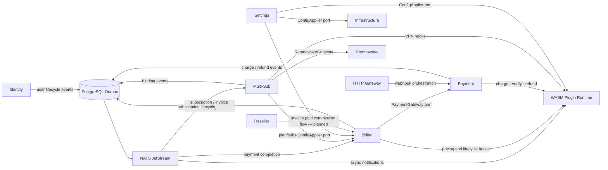

# RemnaCore Context Map

This document is the human-readable projection of
[`internal/app/context_map.go`](../internal/app/context_map.go). The Go
declaration is authoritative and architecture tests verify that the implemented
dependencies match it.

## Domain contexts

| Context | Type | Responsibility |
|---|---|---|
| **Identity** | Generic | Users, sessions, profiles, invitations, Telegram identity, RBAC |
| **Billing** | Core | Plans, checkout, subscriptions, invoices, trials, add-ons, family groups |
| **Multi-Sub** | Core | VPN bindings, provisioning/deprovisioning sagas, reconciliation |
| **Payment** | Supporting | Provider-neutral payment state and plugin-backed operations |
| **Reseller** | Supporting | Shops, tenants, branding, API keys, commissions |
| **Settings** | Supporting | Persisted settings and runtime configuration updates |

Gateway, plugin runtime, infrastructure services, and Telegram are supporting
platform subsystems rather than bounded domain contexts.

## Integration map

## Declared communication paths

| From | To | Mechanism | Purpose |
|---|---|---|---|
| Billing | Multi-Sub | Domain events via outbox and NATS | Provision, update, pause, resume, or remove VPN bindings |
| Payment | Billing | Domain events via outbox and NATS | Complete invoice/payment state transitions |
| Multi-Sub | Billing | Domain event | Traffic-exceeded notification is declared; its consumer is still planned |
| Identity | Plugins | Async event hooks | Registration, verification, and password-reset notifications |
| Billing | Plugins | Async event and sync hooks | Subscription/invoice notifications, pricing, lifecycle extensions |
| Multi-Sub | Plugins | Async event and sync hooks | Binding notifications and VPN provider operations |
| Billing | Payment | Domain-owned port | Create a provider-neutral charge during checkout |
| Multi-Sub | Billing | Read-only ACL ports | Load plan and subscription snapshots for binding calculation |
| Multi-Sub | Remnawave | External gateway | VPN user CRUD and squad assignment |
| Gateway | Payment | Gateway orchestration | Verify provider webhooks and complete payments |
| Settings | Billing | ConfigApplier port | Apply billing runtime settings |
| Settings | Infrastructure | ConfigApplier port | Apply health and speed-test settings |
| Settings | Plugins | ConfigApplier port | Apply plugin runtime limits and hot-reload settings |

The traffic-exceeded consumer and the `invoice.paid` → reseller commission
consumer are declared in the code-level map but are not implemented yet.

## Integration patterns

### Transactional outbox

Domain services persist aggregate changes and outgoing events in the same
PostgreSQL transaction. The outbox relay publishes those records to NATS
JetStream. Consumers are idempotent and sequence-aware; failed messages can be
sent to and replayed from the dead-letter queue.

### Domain-owned ports

The calling context owns its interface:

- Billing owns `PaymentGateway` and `PricingModifier`.
- Multi-Sub owns `RemnawaveGateway`, `VPNProvider`, `PlanProvider`, and
  `SubscriptionProvider`.
- Settings owns its configuration application ports.

Adapters in `internal/adapter/` or wiring in `internal/app/` implement these
interfaces. Domain packages do not import one another directly.

### Anti-Corruption Layer

Multi-Sub uses its own `PlanSnapshot` and VPN request/result types. Adapters
translate Billing persistence and Remnawave API models into those domain-owned
types so external schemas do not leak into the core.

### Plugin hooks

Domains dispatch typed hook payloads through `hookdispatch.Dispatcher`. The
plugin runtime validates the manifest, permissions, HTTP allowlist, limits, and
payload before executing a WASM function. Async domain events are routed to
subscribed plugins through NATS.

## Shared kernel

| Package | Purpose |
|---|---|
| `pkg/domainevent` | Typed events, aggregate recording, publisher contracts |
| `pkg/clock` | Deterministic time abstraction |
| `pkg/txmanager` | Transaction runner contract |
| `pkg/tracing` | OpenTelemetry helpers |
| `pkg/hookdispatch` | Plugin hook dispatcher contract |
| `pkg/tenantctx` | Tenant context propagation |
| `pkg/naming` | VPN username and platform tag generation |

## Enforcement

Architecture tests under `tests/archtest/` verify that:

- domain packages do not import gateway, adapters, infrastructure, or plugin runtime;
- bounded contexts do not import each other directly;
- the implemented wiring matches the declared context map;
- the event catalog and schemas remain synchronized;
- hook payloads do not leak internal domain models.

When adding a communication path:

1. Declare it in `internal/app/context_map.go`.
2. Implement it through an event, domain-owned port, ACL, or gateway orchestrator.
3. Update this document and `docs/events.md` when applicable.
4. Run `go test ./tests/archtest/ -v`.
